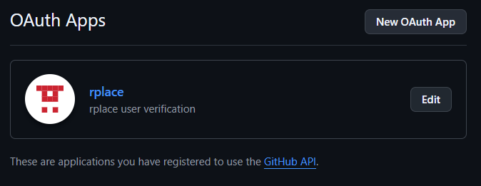
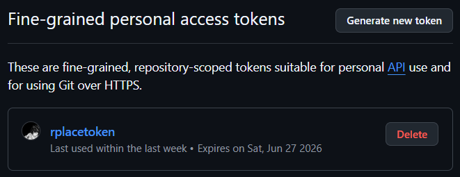
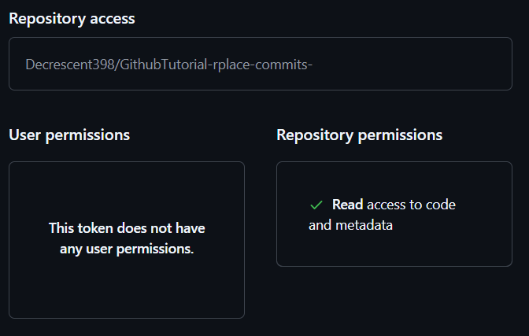

<!-- Improved compatibility of back to top link: See: https://github.com/othneildrew/Best-README-Template/pull/73 -->
<a id="readme-top"></a>
<!--
*** Thanks for checking out the Best-README-Template. If you have a suggestion
*** that would make this better, please fork the repo and create a pull request
*** or simply open an issue with the tag "enhancement".
*** Don't forget to give the project a star!
*** Thanks again! Now go create something AMAZING! :D
-->


<!-- PROJECT SHIELDS -->
<!--
*** I'm using markdown "reference style" links for readability.
*** Reference links are enclosed in brackets [ ] instead of parentheses ( ).
*** See the bottom of this document for the declaration of the reference variables
*** for contributors-url, forks-url, etc. This is an optional, concise syntax you may use.
*** https://www.markdownguide.org/basic-syntax/#reference-style-links
-->

<!-- PROJECT LOGO -->
<br />
<div align="center">
  <a href="r/Hack">
  </a>

  <h3 align="center">r/Hack</h3>

  <p align="center">
    r/place like platform for Clubs YSWS
    <br />
    <a href="http://localhost:8000">View Demo</a>
    &middot;
    <a href="https://github.com/decrescent398/r-place/issues/new?labels=bug&template=bug-report---.md">Report Bug</a>
    &middot;
    <a href="https://github.com/decrescent398/r-place/issues/new?labels=enhancement&template=feature-request---.md">Request Feature</a>
    &middot;
    <a href="https://github.com/decrescent398//GithubTutorial-rplace-commits-">Participants<a>
  </p>
</div>

<!-- ABOUT THE PROJECT -->
## About The Project
https://github.com/user-attachments/assets/37fb2707-1818-4850-a2d2-3854aa703dd2

This is an attempt at recreating the magic of r/place. r/hack was built as a platform for clubs to get better at using git for HackClub.

Features:
* Websockets for real-time pixel updates
* OAuth to avoid bots
* Database that records and timestamps all canvas updates

<p align="right">(<a href="#readme-top">back to top</a>)</p>


### Built With

* https://reflex.dev
* https://neon.com
* https://developer.github.com
* https://www.postgresql.org/

<p align="right">(<a href="#readme-top">back to top</a>)</p>


<!-- GETTING STARTED -->
## Getting Started

### Prerequisites

* Python >= 3.12

### Environment Variables

* pip
  ```sh
  pip install -r requirements.txt
  ```

* Github

    #### Set up for OAuth

     Go to https://github.com/settings/developers and create a new oauth app. 

     make sure the **Homepage URL** ends with **/canvas** and the **Authorization callback URL** ends with **/canvas/callback**

     **Note:** you will have to change these urls manually should you decide to redeploy the website somewhere else.

     Save the ClientID and Client Secret

     Go to https://github.com/settings/personal-access-tokens and generate a fine-grained Personal Access Token (PAT)
     

     make sure it has the following permissions

     

     The repository it is pointing to can be a blank repository with rudimentary way of contribution, so that each contributor can be verified as a real person.

* Database
    Head over to neon and get your postgres db url

Add these vars to .env.template and change it to a .env

### Installation

1. Clone the repo
   ```sh
   git clone https://github.com/decrescent398/r-place.git
   ```
2. Get the required tokens from Github and Neon as described in Getting Started
3. Install pip packages
4. Update .env
5. Set up reflex database
    ```sh
    reflex db init
    ```
6. Run the reflex app
    ```sh
    reflex run
    ```

<p align="right">(<a href="#readme-top">back to top</a>)</p>


<!-- CONTRIBUTING -->
## Contributing

Contributions are what make the open source community such an amazing place to learn, inspire, and create. Any contributions you make are **greatly appreciated**.

If you have a suggestion that would make this better, please fork the repo and create a pull request. You can also simply open an issue with the tag "enhancement".
Don't forget to give the project a star! Thanks again!

1. Fork the Project
2. Create your Feature Branch (`git checkout -b feature/AmazingFeature`)
3. Commit your Changes (`git commit -m 'Add some AmazingFeature'`)
4. Push to the Branch (`git push origin feature/AmazingFeature`)
5. Open a Pull Request

<!-- LICENSE -->
## License

Distributed under the Unlicense License. See `LICENSE.txt` for more information.

<p align="right">(<a href="#readme-top">back to top</a>)</p>
